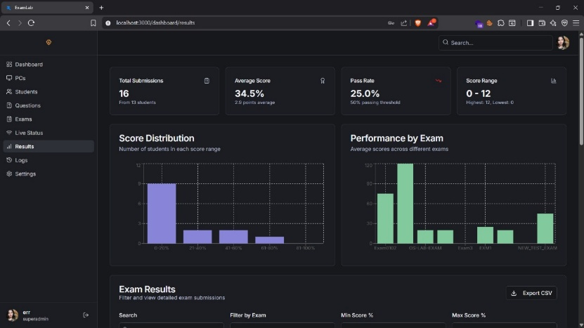

<div align="center">
  

  # AEGIS ExamLab
  
  **Secure, Intelligent, and Proctored Examination Management System**

  [](https://nextjs.org/)
  [](https://www.typescriptlang.org/)
  [](https://www.mongodb.com/)
  [](https://opensource.org/licenses/MIT)

  [**Explore Full Documentation**](https://error-siddh.github.io/AEGIS) | [**Report Bug**](../../issues) | [**Request Feature**](../../issues)
</div>

---

## Overview

**AEGIS ExamLab** is a production-ready, open-source platform designed to administer and monitor secure exams across local network labs or remote environments. Built on a modern Next.js App Router architecture, AEGIS prioritizes **strict server-side validation**, **real-time telemetry**, and **AI-assisted question generation**.

## Core Features

- **Workstation (PC) Binding**: Devices self-register and receive unique cryptographic identifiers. Administrators approve and bind students directly to specific hardware.
- **AI-Assisted Question Bank**: Google Genkit (Gemini) integration automatically categorizes questions by difficulty and generates semantic tags. The system fully supports LaTeX notation and code snippets.
- **Live Telemetry & Monitoring**: Track student progress in real-time. Workstations transmit HTTP heartbeats every 15 seconds, transitioning through defined states: *Online → Ready → Attempting → Finished*.
- **Strict Validation**: A 5-point server-side validation chain prevents unauthorized access, blocks duplicate submissions, and sanitizes injected payloads.
- **Robust Analytics**: Provides exportable examination results, score distribution histograms, and comprehensive administrative audit logging.

---

## Quick Start

Ensure the deployment environment has Node.js 18+ and a running MongoDB instance.

### 1. Clone & Install
```bash
git clone https://github.com/ERROR-SIDDH/AEGIS.git
cd AEGIS
npm install
```

### 2. Configure Environment
Initialize the environment configuration and define the MongoDB connection string and Gemini API Key:
```bash
cp .env.example .env
```

### 3. Seed Database
On a fresh deployment, execute the following script to provision the default administrator credentials:
```bash
node scripts/seed-db.js
```

### 4. Run Development Server
```bash
npm run dev
# The application will start on http://localhost:9002
```

> **Note:** The `pcs` collection requires a **sparse unique index** on the `macAddress` field. If workstation approval fails, execute `node database-fix.js` within your MongoDB shell.

---

## Comprehensive Documentation

The full documentation suite details system architecture, API references, and deployment procedures.

* [**Getting Started**](https://error-siddh.github.io/AEGIS/getting-started.html) — Advanced installation and Docker deployment specifications.
* [**Architecture**](https://error-siddh.github.io/AEGIS/architecture.html) — Technical breakdown of the data model and security chain.
* [**API Reference**](https://error-siddh.github.io/AEGIS/api-reference.html) — Specifications for all implemented Server Actions.
* [**Admin Guide**](https://error-siddh.github.io/AEGIS/admin-guide.html) — Operational guidelines and CSV import formatting rules.

*(To view the documentation locally, open `docs/index.html` in a web browser).*

---

## Security Architecture

AEGIS implements a zero-trust policy regarding client requests. Every attempt to fetch examination data or submit answers is routed through `src/lib/actions.ts` and must satisfy the following validation chain:

1. The Workstation exists and is marked as **Approved** by an Administrator.
2. The Workstation's assigned student ID matches the requested user.
3. The student's assigned exam matches the requested exam.
4. The examination status is strictly set to **In Progress**.
5. The student has not previously submitted a result for the designated exam.

All validation processes execute entirely on the server via Next.js Server Actions, ensuring database logic remains isolated from the client bundle.

---

## Contributing & Future Roadmap

Open-source contributions are welcome. The current strategic focus involves transitioning validation protocols to the **Operating System (OS) level** to establish a kiosk-style, fundamentally impenetrable execution environment.

Refer to the [Contribution Guidelines](https://error-siddh.github.io/AEGIS/contributing.html) for development workflows and planned architectural enhancements.

---
<div align="center">
  <i>Engineered for secure academic administration.</i>
</div>
